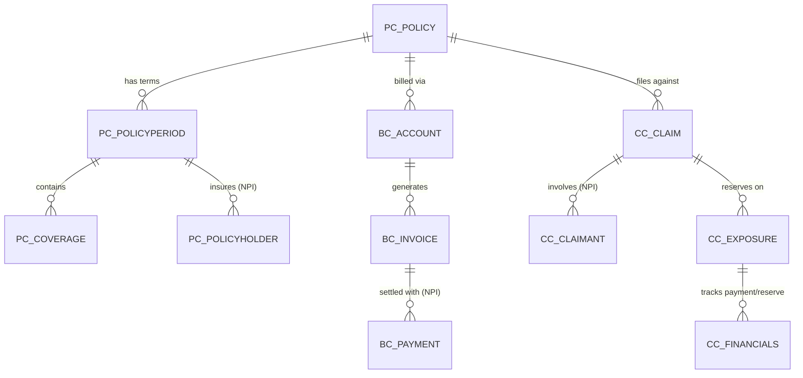
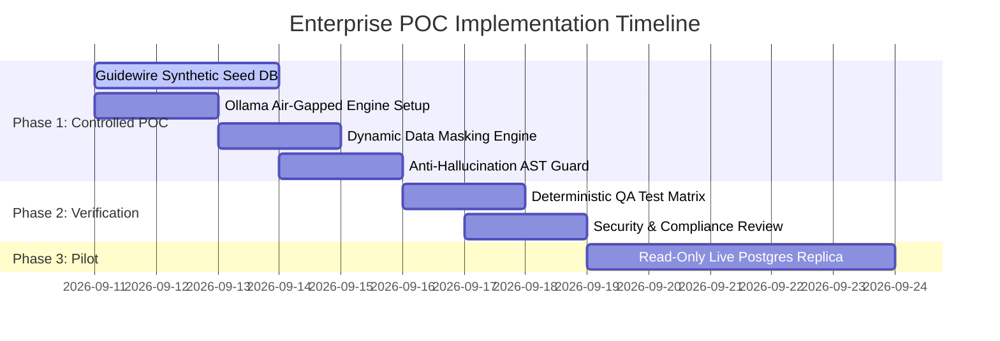

# Executive Architecture & Security Compliance Proposal
## AI-Powered Conversational Query Studio for Guidewire Insurance Suite
**Document Classification:** Internal / Enterprise Confidential  
**Target Audience:** Engineering Leadership, IT Management, Chief Information Security Officer (CISO), Compliance & Legal  
**Scope:** Guidewire PolicyCenter, BillingCenter, ClaimCenter Data Analytics via Local LLM (Ollama)  
**Date:** September 2026  
**Status:** Ready for Security & Management Sign-Off  

---

## 1. Executive Summary

Enterprise insurance organizations face high backlogs of ad-hoc data reporting requests across Guidewire core applications (**PolicyCenter**, **BillingCenter**, and **ClaimCenter**). Underwriters, claim examiners, and billing analysts require timely insights (e.g., loss ratios by product, open reserves trends, past-due billing aging), but are constrained by SQL complexity and DBA dependencies.

This proposal details an **enterprise-grade, conversational query studio** that translates natural language questions into optimized, read-only PostgreSQL queries. 

### Key Security & Business Guarantees:
1. **100% Local Processing (Zero Data Egress):** Powered by an on-premises / local **Ollama** engine (`http://127.0.0.1:11434`). No company data, prompts, or schema information ever leave the enterprise network boundary.
2. **Comprehensive NPI / PII Protection:** Adheres to GLBA, HIPAA, and state insurance regulations via automated, in-flight **Dynamic Data Masking (DDM)** and strict **Prompt Isolation** (raw data rows are *never* supplied to the LLM).
3. **Deterministic Anti-Hallucination Controls:** Enforces a 4-step verification framework based on strict enterprise QA standards; never invents tables or columns, and returns *"Insufficient information to determine"* whenever required data points are absent.
4. **Air-Tight Read-Only Safety:** Multi-layered defense preventing any modification of database records via SQL AST parsing and PostgreSQL database-level `READ ONLY` transaction isolation.

---

## 2. Regulatory & Compliance Alignment

The system is architected specifically to satisfy stringent insurance industry mandates:

| Regulation / Standard | Mandated Requirement | Query Studio Implementation Safeguard |
| :--- | :--- | :--- |
| **GLBA Safeguards Rule** (16 CFR Part 314) | Protection of customer Non-Public Personal Information (NPI) against unauthorized disclosure. | **Two-Tier Masking:** LLM never sees customer rows; output engine masks SSNs, bank accounts, and contact info in-flight. |
| **HIPAA Privacy & Security Rules** | Protection of Protected Health Information (PHI) in claim bodily injury & exposure files. | Claimant medical/exposure records are redacted; claimant identity fields are masked with tokenized identifiers. |
| **NYDFS 23 NYCRR 500 / NAIC Model #668** | Strict access controls, audit trail requirements, and data risk assessments. | Comprehensive, immutable audit logging capturing query source, generated SQL, tables touched, and masking counts. |
| **Enterprise InfoSec / Vendor Risk** | Prohibition against transmitting core insurance data to multi-tenant public AI cloud APIs. | **100% Air-Gapped / Local Inference:** Ollama runs on private localhost or secure internal subnet with 0 external network calls. |

---

## 3. High-Level System Architecture

```
                                  ENTERPRISE PERIMETER
┌────────────────────────────────────────────────────────────────────────────────────────┐
│                                                                                        │
│   ┌──────────────────────┐               ┌─────────────────────────────────────────┐  │
│   │   Browser Frontend   │◄─────────────►│          Backend Security Gateway       │  │
│   │ (React Data Studio)  │               │              (Node.js / Express)        │  │
│   └──────────────────────┘               └───────────────────┬─────────────────────┘  │
│              ▲                                               │                         │
│              │                                               ▼                         │
│    Masked Data & Charts                         ┌─────────────────────────────┐        │
│                                                 │   Prompt Sanitizer          │        │
│                                                 │   (Schema ONLY - Zero Rows) │        │
│                                                 └──────────────┬──────────────┘        │
│                                                                │                       │
│                                                                ▼                       │
│                                                 ┌─────────────────────────────┐        │
│                                                 │     Local Ollama LLM        │        │
│                                                 │ (127.0.0.1:11434 - Offline) │        │
│                                                 └──────────────┬──────────────┘        │
│                                                                │ Generated SQL         │
│                                                                ▼                       │
│                                                 ┌─────────────────────────────┐        │
│                                                 │ Anti-Hallucination & AST    │        │
│                                                 │ Read-Only Verification      │        │
│                                                 └──────────────┬──────────────┘        │
│                                                                │ Verified SELECT Only  │
│                                                                ▼                       │
│                                                 ┌─────────────────────────────┐        │
│                                                 │    PostgreSQL Database      │        │
│                                                 │  (SET TX READ ONLY; 10s TO) │        │
│                                                 └──────────────┬──────────────┘        │
│                                                                │ Raw Results           │
│                                                                ▼                       │
│                                                 ┌─────────────────────────────┐        │
│                                                 │ Dynamic Data Masking (DDM)  │        │
│                                                 │  & Immutable Audit Logger   │        │
│                                                 └─────────────────────────────┘        │
│                                                                                        │
└────────────────────────────────────────────────────────────────────────────────────────┘
```

---

## 4. The 5-Layer Defense-in-Depth Security Model

### Layer 1: Prompt Isolation & Zero-Data Egress
* **The Vulnerability in Generic AI Tools:** Sending sample table data rows or raw CSV extracts to cloud LLMs violates corporate data policies.
* **Our Defense:** The system performs **structural-only introspection**. The prompt sent to Ollama contains *only*:
  * Table names (e.g., `pc_policy`, `bc_invoice`, `cc_claim`)
  * Column names and data types (e.g., `totalpremium NUMERIC`, `lossdate DATE`)
  * Foreign key relationships
* **Absolute Guarantee:** **Zero policyholder records, claim details, or billing transaction rows are ever supplied to the LLM context.**

### Layer 2: Anti-Hallucination & Catalog Verification (Anti-Hallucination Rule)
* **The Vulnerability:** LLMs can invent non-existent columns (e.g., `credit_score` or `churn_risk`) or fabricate joins that produce incorrect financial metrics.
* **Our Defense (4-Step Verification Pipeline):**
  1. **Fact Extraction:** Grounds the query strictly in verifiable tables and columns discovered in the active PostgreSQL database catalog.
  2. **Gap Analysis:** If a user asks for attributes not present in the Guidewire schema, the engine halts and returns:  
     `"Insufficient information to determine: [Specific Missing Attributes]"`  
     rather than guessing or fabricating SQL.
  3. **Grounded SQL Generation:** SQL is generated strictly using Step 1 verified facts. Any inferred assumptions are explicitly tagged as `"Inference (low confidence)"`.
  4. **Pre-Flight AST Verification:** An Abstract Syntax Tree (AST) parser cross-references every table and column in the generated SQL against the verified catalog before sending the query to PostgreSQL.

### Layer 3: Dynamic Data Masking (DDM) Engine
* **The Vulnerability:** Accidental exposure of policyholder Social Security Numbers, banking credentials, or personal contact details to internal users without clearance.
* **Our Defense:** All query results pass through an automated pattern and column-classification masking engine before serialization to the client:
  * **Social Security / Tax ID Numbers:** Masked to `***-**-1234`
  * **Bank Account / Credit Card Numbers:** Masked to `****-****-****-5678`
  * **Email Addresses:** Masked to `j****@domain.com`
  * **Phone Numbers:** Masked to `(***) ***-1234`
  * **Date of Birth:** Redacted to year-only or `****-**-**`
  * **Claimant Personal Identifiers:** Masked relationship-bound tokens.

### Layer 4: Multi-Tier Read-Only Guardrails & Resource Caps
* **Application Level (AST Guard):** Rejects any SQL statement containing `DROP`, `DELETE`, `UPDATE`, `INSERT`, `ALTER`, `TRUNCATE`, `GRANT`, `REVOKE`, `EXEC`, or multiple chained statements (`semicolon injection`).
* **Session Level (PostgreSQL Engine):** All connections execute within an explicit `SET TRANSACTION READ ONLY;` session block. The PostgreSQL kernel will abort any write transaction even if application checks were somehow bypassed.
* **Denial of Service Prevention:** Hard statement timeout limit (`SET statement_timeout = 10000;` / 10 seconds) and pagination clamp (`LIMIT 200`) prevent runaway joins or memory exhaustion.

### Layer 5: Immutable Compliance Audit Logging
Every action generates a structured JSONL compliance log entry:
* Timestamp (UTC / ISO 8601)
* User / Session Identifier
* Original Natural Language Prompt
* Generated & Executed SQL Query
* Specific Guidewire Entities Touched (`pc_*`, `bc_*`, `cc_*`)
* NPI Fields Detected and Masked Count
* Query Execution Time & Row Count

---

## 5. Guidewire Core Suite Data Model Specification (POC Dataset)

To facilitate immediate, risk-free evaluation, the Proof of Concept includes a **preloaded Guidewire demo database** with synthetically generated data that mirrors production relational structures:



1. **PolicyCenter (`pc_*`)**:
   - `pc_policy`: Policy Number, Product Line (Residential, Commercial), Policy Status, Inception Date.
   - `pc_policyperiod`: Term Number, Effective Dates, Written Premium, Underwriting Entity.
   - `pc_coverage`: Coverage Code, Limits, Deductibles.
   - `pc_policyholder`: Synthetic customer records with NPI fields for validation of masking rules.

2. **BillingCenter (`bc_*`)**:
   - `bc_account`: Account Number, Billing Method (Direct Bill, Agency Bill), Payment Plan.
   - `bc_invoice`: Invoice Number, Due Date, Billed Amount, Paid Amount, Aging Status.
   - `bc_payment`: Payment Method (ACH, Card, Lockbox), Masked Account Token.

3. **ClaimCenter (`cc_*`)**:
   - `cc_claim`: Claim Number, Policy Link, Loss Date, Reported Date, Loss Cause (Collision, Wind, Water, Fire), Status (Open, Closed).
   - `cc_claimant`: Claimant relationship to policyholder (NPI protected).
   - `cc_exposure`: Exposure Category (Bodily Injury, Property Damage, Collision).
   - `cc_financials`: Incurred Loss, Total Paid, Open Reserves, Subrogation / Salvage Recoveries.

---

## 6. Implementation & Rollout Roadmap



### Phase 1: Synthetic Guidewire POC (Zero Risk)
* Execute with 100% synthetic Guidewire data.
* Validate that all NPI detection and masking rules function with 100% reliability.
* Benchmark Ollama response accuracy and latency on local hardware.

### Phase 2: Security & QA Validation
* Run automated positive, negative, boundary, edge, and anti-hallucination test suites.
* Present live compliance audit logs to InfoSec.

### Phase 3: Read-Only Internal Pilot
* Connect to a dedicated, read-only PostgreSQL reporting replica.
* Implement database user credentials restricted strictly to `SELECT` permissions.

---

## 7. Security Officer & Management Sign-Off Matrix

| Role | Name | Title | Decision | Signature / Date |
| :--- | :--- | :--- | :--- | :--- |
| **Engineering Sponsor** | | Engineering Manager / Director | [ ] Approved [ ] Revisions Requested | ____________________ |
| **Information Security (CISO)** | | Chief Information Security Officer | [ ] Approved [ ] Revisions Requested | ____________________ |
| **Data Governance & Compliance** | | Privacy / Compliance Officer | [ ] Approved [ ] Revisions Requested | ____________________ |
| **Principal Database Architect**| | Lead DBA / Data Warehouse Architect| [ ] Approved [ ] Revisions Requested | ____________________ |

---

*This document is maintained under configuration management in the project repository.*
